

**학사학위 졸업논문**

**열연 공정 표면 결함 검출의 머신러닝**

**Comparison of Steel Surface Defects Classification Model based on Machine Learning Algorithm**

**한양대학교 산업공학과**

# **목 차**

[국문 요지](#국문-요지)

[1. 서론](#서론)

[1.1. 연구 배경](#연구-배경)

[1.2. 연구목적 및 연구범위](#연구목적-및-연구범위)

[2. 기존연구](#기존연구)

[2.1. 문헌조사 요약](#문헌조사-요약)

[2.2. 문헌조사](#문헌조사)

[2.2.1. EfficientNet](#efficientnet)

[2.2.2. Vision Transformer](#vision-transformer)

[2.2.3. Support Vector Machine](#support-vector-machine)

[2.2.4. 랜덤 포레스트(Random Forest)](#랜덤-포레스트random-forest)

[2.2.5. 철강 표면 검사](#철강-표면-검사)

[2.3. 차별성 및 우수성](#차별성-및-우수성)

[3. 문제정의](#문제정의)

[3.1. 머신러닝을 활용한 이미지 분류](#머신러닝을-활용한-이미지-분류)

[3.2. 열간압연(열연) 공정](#열간압연열연-공정)

[3.3 표면 결함 검출 시스템](#표면-결함-검출-시스템)

[4. 접근방법](#접근방법)

[4.1. 서버 환경](#서버-환경)

[4.2. 성능 평가 지표](#성능-평가-지표)

[4.3. 하이퍼파라미터](#하이퍼파라미터)

[4.3.1. Efficient Net](#efficient-net)

[4.3.2. Vision Transformer](#vision-transformer-1)

[4.3.3. SVM](#svm)

[4.3.4. Random Forest](#random-forest)

[5. 연구결과](#연구결과)

[5.1. EfficientNet](#efficientnet-1)

[5.2. Vision Transformer](#vision-transformer-2)

[5.3. SVM](#svm-1)

[5.4. Random Forest](#random-forest-1)

[5.5. 모델 비교](#모델-비교)

[6. 논의 및 결론](#논의-및-결론)

[참고 문헌](#_Toc106329824)

# 국문 요지

결함 검사 공정의 경우 일반적인 제조 공정에서 품질관리를 위해 필수적인 데
반해 여전히 대부분 고전적인 영상처리 기반의 비전검사 혹은 사람의 육안에
의해 이루어진다. 이로 인해 많은 공장의 검사 공정에서 병목 현상이
일어나고 정확도에 있어서도 일관적이지 않다는 문제점이 있다. 이러한 검사
공정들은 대체로 반복적이고 패턴화되어 있기 때문에 머신러닝을 활용해
기존보다 높은 정확도와 속도를 가지는 자동화로 대체할 수 있다.

이에 본 연구에서는 현장에서의 검사 공정 머신러닝 모델 선별과 예측력 비교
연구를 진행하기 위해 머신러닝 모델 EfficientNet, ViT(Vision
Transformer), SVM(Support Vector Machine), RandonForest들을 비교한다. 각
모델들의 Batch size, Buffer size, Patch size, Learning rate와 같은
하이퍼파라미터 값들을 조정하여 어떤 조합일 때 가장 성능이 좋은지를
비교분석하였다. 이를 통해 머신러닝을 통한 검사 공정 자동화를 계획하고
있는 사람들에게 하이퍼파라미터 값 설정에 있어 가이드라인이 되고자 한다.

분류 대상은 열연 공정 과정 중 금속 표면 결함이다. 본 논문의 데이터셋은
철강 제조 공정에서의 대표적인 표면 결함 이미지로 결함의 종류는 Crazing,
Inclusion, Patches, Pitted surface, Rolled-in Scale, Scratches로 총
6가지이다. 분석은 결함 사진을 구하기 힘든 현실 상황을 반영하고자 각
클래스 당 단 300개만의 이미지를 활용하여 총 1800장의 이미지를
사용하였다.

연구결과 딥러닝 모델인 EfficientNet 모델이 accuracy, recall, precision,
F1-score에서 모두 0.997를 상회하여 가장 높은 예측 정확도를 보였다.
또다른 딥러닝 모델인 ViT는 0.975의 accuracy값을 가져 그 다음으로 높은
정확도를 보였다. 이에 결함 이미지의 개수가 적은 상황에서는
EfficientNet이 비교적 좋은 성능을 냄을 확인할 수 있었다. 고전적인
머신러닝 모델들인 SVM과 RandomForest는 각각 0.6944, 0.7833의 accuracy
값을 가져 딥러닝 모델들에 비해 성능이 좋지 못했다. 이러한 비교 분석을
통해 머신러닝을 실제 현장에 적용 시에 어떤 모델이 유리할지에 대한
가이드라인 또한 제공하고자 한다.

1.  # 서론

    1.  ## 연구 배경

국가 정책의 영역까지 인공지능이 들어오게 된 것은 2010년대 이후
심층학습(Deep Learning)이라는 기술이 비약적으로 발전한 뒤로, 단 10년
정도에 불과하다. 2012년 심층 신경망(Deep Neural Network)
'알렉스넷(AlexNet)'이 등장하자마자 당시 가장 낮은 이미지 식별
에러율이었던 26%을 압도적으로 앞서는 16%를 선보이며 놀라운 성과를
보였다. 2015년 딥러닝을 적용한 이미지 분류 모델의 등장 이후 단 3년만에
마이크로소프트의 '레지넷(ResNet)'이 3.56%의 에러율에 도달하며 인간의
에러율로 알려진 5%를 이기게 된다.

이러한 급속한 인공지능의 발전으로 인해 산업과 사회 전반에 걸쳐 핵심
기술로 부상하였고, 여러 국가 및 기업에서 AI 마스터플랜을 수립하기
시작했다. 우리 정부도 디지털 뉴딜 사업의 일환으로서 공장의 자동화를 위한
스마트공장 지원 사업을 진행하고 있으며, 2022년까지 스마트공장 3만개
보급을 목표로 다양한 사업을 추진중에 있다 (중소벤처기업부, 2018).

하지만, 세계적으로 보았을 때 생산제조 분야에서 인공지능을 도입한
비율은 12%에 불과하다 (강송희, 2021). 한국의 경우 GDP 대비 제조업
비중이 25%를 상회하는 제조업 중심의 나라이다 (한국저작권위원회, 2019).
따라서 국가 경쟁력을 위해 제조업 분야에서의 인공지능 활용을 통한
생산성 향상은 필수적이다. 하지만 인공지능을 공정에 적용하기 위해서는
데이터 수집, 데이터 전처리, 모델 생성 및 개선, 그리고 실제 공정에
도입까지 일련의 과정을 거쳐야 한다. 하지만 대부분의 기업들은 지식과
전문 인력의 부족으로 도입에 어려움을 겪고 있다.

제품 설계, 모니터링 및 수요 예측 등 다양한 분야에서 인공지능을
적용하여 효율성을 개선할 수 있다. 그 중에서도 검사 공정은 일반적인
제조 공정에서 품질관리를 위해 필수적인 데 반해 여전히 대부분 영상처리
기반의 비전검사 혹은 사람의 육안에 의해 이루어진다. 이로 인해서 많은
공장의 검사 공정에서 병목 현상이 일어나고 있다. 사람의 육안으로 부품
불량 여부를 판단할 경우, 노동자의 피로도나 주관적 기준에 따라 검사
품질이 일관되지 않을 수 있다. 미세 결함을 검출해야 하는 경우나,
육안으로 판단하는 데 시간이 오래 걸리는 경우에는 이러한 문제들이 더욱
부각된다. 또한 최저임금 상승 등의 영향으로 인건비가 상승하고 있어 검사
공정에서의 비용부담 또한 늘고 있다.

## 연구목적 및 연구범위

이에 공장에서 불량품 검출을 자동화하기 위해 머신러닝을 적용할 수 있도록
모델, 하이퍼파라미터 값 조정에 대한 가이드라인을 제공하고자 한다.

이 연구에선 다음의 사항들을 고려했다. 첫째, 현실에서 결함 데이터를
구하기 어렵다는 점을 고려하여, 작은 데이터셋으로도 높은 성능을 낼 수
있는 모델을 적용해야 한다. 본 연구에서는 분류(Classification)계열의
딥러닝 모델인 EfficientNet를 가장 좋은 성능을 보일 모델로 예측하여
선정했다. EfficientNet은 적은 파라미터 대비 압도적인 성능을 가진 모델로
알려져 있다. 그리고, 이 모델에 대한 비교 모델들로 2022년 SotA(State of
the Art)를 달성한 딥러닝 모델인 ViT(Vision Transformer), 그리고 고전적인
머신러닝 모델들인 Random Forest, SVM를 선정하였다. 둘째, 현장결함검사의
데이터와 유사하여 실제와 같은 정확도를 산출할 수 있을 데이터셋을
학습시켜야 한다. 본 연구의 이미지 데이터는 실제 공정을 통해 생산된 철
표면의 사진으로 North Eastern University의 surface defect detection
데이터베이스를 사용했다. 철강 제조 공정에서의 대표적인 표면 결함
데이터셋으로 총 6종류가 있으며, 현장에서 결함 데이터를 얻는 것이 어려울
수 있다는 상황을 고려하여 각 클래스당 300개의 이미지만을 활용하였다.
이에 총 1800장의 이미지로 구성되어 있다.

본문의 기여점은 금속 주조제품의 결함검사에 대한 딥러닝 솔루션을 제공하고
딥러닝 모델 EfficientNet의 정확도와 다른 알고리즘 간의 비교를 통해, 어떤
모델이 2차원 이미지 결함 검사 공정에 적합한지에 대한 성능 비교분석을
제공한다.

결론에서는 이를 공정에 적용함에 따라 품질검사의 정확도가 향상됨을 확인할
것이다. 이로 인해 품질 향상과 인건비 감소로 제조업 환경 변화에서 경쟁
우위를 차지할 것을 기대한다.

2.  # 기존연구

    1.  ## 문헌조사 요약

본 절에서는 EfficientNet과 비교 모델인 ViT(Vision Transfomrer),
SVM(Support Vector Machine), Randomforest 모델에 대해 알아본다. 또한
현재까지의 철강 표면 검사 공정에서의 연구 동향을 살펴본다.

2.  ## 문헌조사

    1.  ### EfficientNet

EfficientNet은 2019년에 발표된 모델로, 최초로 compound scaling 방법을
제안한 모델이다. Compound scaling이란 모델의 정확도를 높일 때 일반적으로
조절하는 모델의 깊이(depth), 너비(width), 입력 이미지의
크기/해상도(resolution), 이 세 가지를 효율적으로 조절할 수 있는
방법이다.

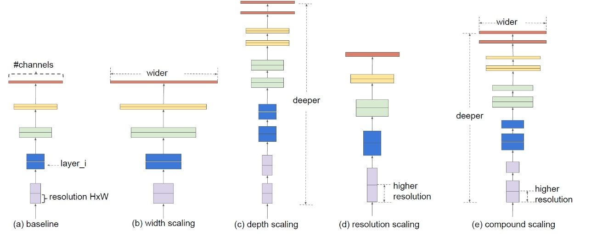

모델 스케일링 방법은 우선 baseline에서 입력값X가 각 레이어 함수(F)를
거쳐 최종 출력값 N을 생성한다. 수식으로 표현하면 다음과 같다.
$< H_{i},\ W_{i},C_{i} >$는 입력값 $X_{1}$의 크기이다.

$$N = F_{k} \odot \ldots \odot F_{2} \odot F_{1}\left( X_{1} \right) = \odot_{j = 1\ldots k}F_{j}(X_{1})$$

이 수식을 일반화하면 다음과 같다.

$$N = \odot_{i = 1\ldots s}F_{I}^{L_{i}}(X_{< H_{i},\ W_{i},C_{i} >})$$

여기서 각 레이어에서 수행하는 연산(F)을 고정하고 깊이(d), 너비(w), 입력
이미지 크기(r)에만 집중하여 탐색 공간(search space)이 감소한다.
Flops(Floating point operations)는 단위 시간당 연산횟수를 뜻한다.

$$\max_{d,w,r}{\ \ \ \ \ Accuracy\left( N(d,w,r) \right)}$$

$$s.t.\ \ \ \ \ \ N(d,w,r) = \odot_{i = 1\ldots s}{\widehat{F}}_{i}^{d*\widehat{L}i}(X_{< {r*\widehat{H}}_{i},{r*\widehat{W}}_{i},{w*\widehat{C}}_{i} >})$$

$$Memory(N) \leq target_{memory}$$

$$FLOPS(N) \leq target\_ flops$$

$$X_{i}:\ \ \ \ \ \ \ \ \ \ \ input\ tensor,\ with\ tensor\ shape < H_{i},\ W_{i},\ C_{i} >$$

$$Y_{i}:\ \ \ \ \ \ \ \ \ \ \ output\ tensor$$

$$F_{i}:\ \ \ \ \ \ \ \ \ \ \ operator$$

$$H_{i},\ W_{i}:\ \ \ spatial\ dimention$$

$$C_{i}:\ \ \ \ \ \ \ \ \ \ channel\ dimention\ $$

ConvNet의 크기를 키우는 것은 이미 널리 쓰이는 방법이다. 하지만
네트워크의 깊이가 증가할수록 모델의 용량이 커지고 더 복잡한 특징들을
잡을 수 있지만 학습시키는 과정에서 기울기 값이 사라지는 문제가 발생할 수
있고, 너비와 입력 이미지의 크기도 커질수록 정확도는 높아지지만 계산량이
제곱에 비례하여 증가한다는 특징이 있다. 결론적으로 네트워크를 깊게
만들어 더 넓은 영역의 특징들을 잘 잡아내게 하고 더 큰 이미지의 세부적인
내용을 잡아내기 위해 레이어의 너비를 증가시켜야 한다. 다음 그림은 깊이,
너비, 이미지 크기를 하나만 조절했을 때와 동시에 조절(compound
scaling)했을 때의 성능을 비교한 것이다. 결과적으로 세 가지 변수는
밀접하게 연관이 있으며 같은 비율로 움직여야 한다.

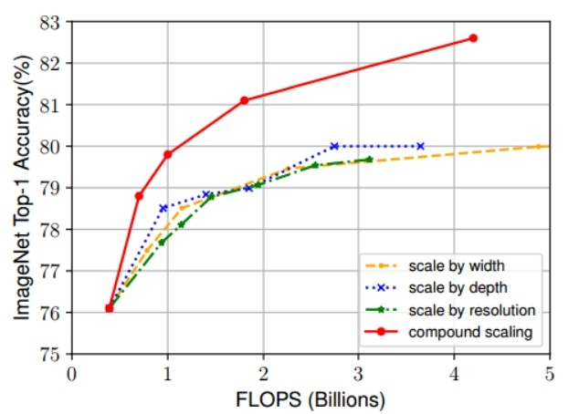

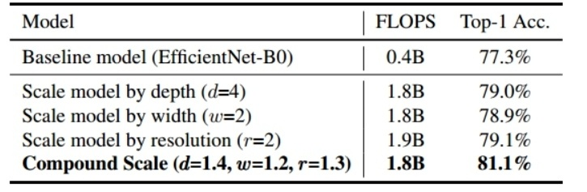

Compound scaling의 과정은 다음과 같다, 연구 논문에서는 전체 계산량을
2ϕ에 비례하게 잡았다. 우선 깊이(depth)를 α, 너비(width)를 β, 이미지의
해상도(resolution)를 γ로 만들고 Φ=1일 때의
$\alpha \times \beta^{2} \times \gamma^{2} = 2$를 만족하는 α, β, γ을
격자탐색을 통해 찾는다 2. Φ(0, 0.5, 1, 2, 3, 4, 5, 6)을 사용해
최종적으로 깊이, 너비, 해상도에 곱할 인자(factor)를 만든다.

EfficientNet의 구조는 MnasNet의 baseline network를 기반으로 수정하여
만들어졌다. 모델의 실행 결과 기존의 CNN 기반 SotA 모델보다 더 높은
정확도를 보여주었고 비슷한 정확도를 보인 다른 모델들과 비교해봤을 때 약
6배 정도 빠른 속도를 보여주었다 (MingxingTan & QuocLe, 2020).

### Vision Transformer

Vision Transformer는 Transformer를 비전분야에 사용한 것으로 2021년에
구글 리서치를 통해 발표되었다. ViT는 기존의 제한적인 어텐션 메커니즘에서
벗어나, 이미지 패치에서 CNN에 의존하지 않고 순수 트랜스포머가 곧바로
이미지 패치들에 잘 적용되는 것을 보여준다. 다양한 연구에서 CNN 같은
구조를 셀프 어텐션(Self-attention)과 결합하려는 시도를 해왔는데 특수한
어텐션 패턴 때문에 효과적으로 스케일링이 불가능했다. 이에 NLP에서
트랜스포머 스케일링이 성공한 것에 영감을 받아, 표준 트랜스포머를
최소한의 수정으로 직접 이미지에 적용하는 것에 대한 실험을 진행하였다.
자세한 모델의 개요는 다음과 같다.

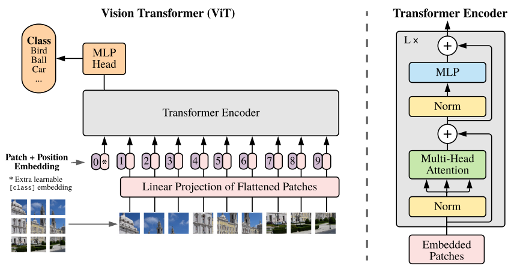

기본적으로 Transformer 구조에서는 다음과 같이 각 단어가 벡터로 표현되어
입력된다.

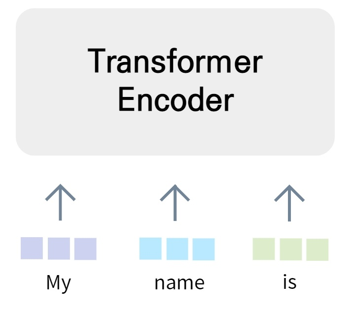

ViT는 이러한 Transformer에 이미지를 넣어 다루는 것이다. 다음 이미지와
같이 이미지를 패치로 나눠서 각 배치를 단어처럼 다룬다. 각 단어를
패치처럼 다루기 때문에 패치를 벡터에서 플래튼(flatten)한다. 모든 패치에
대해 동등하게 벡터와 플래튼 처리하여 인코더에 입력한다.

일반적인 트랜스포머는 토큰 임베딩(token embedding)에 대한 1차원의
시퀀스를 입력을 받는 반면 연구 논문에서는 2차원의 이미지를 다루기 위해
3차원인 이미지 ${x \in R}^{H*W*C}$ 를 2차원의 패치들
$x_{p} \in R^{N*\left( P^{2}*C \right)}$로 플래튼하였다. 여기서 (H,W)는
원본 이미지의 크기, C는 채널 개수, (P,P)는 이미지 패치의 크기를
의미한다. $N = \frac{HW}{P^{2}}$는 패치의 수를 의미하는데 유효 시퀀스의
길이로써 바라볼 수도 있다. 아키텍처는 기존 트랜스포머의 엔코더 부분과
거의 동일하다. 수식으로 모델을 표현하면 다음과 같다.

$z_{0} = \left\lbrack x_{class};\ x_{p}^{1}E;\ x_{p}^{2}E;\ldots;\ x_{p}^{N}E \right\rbrack + E_{pos}$ ,
$E \in R^{\left( P^{2}*C \right)*D},\ E_{pos} \in R^{(N + 1)*D}$

${z^{'}}_{l} = MSA\left( LN\left( z_{l - 1} \right) \right) + z_{l - 1}, l = 1\ldots$

$z_{l} = MLP\left( LN\left( {z^{'}}_{l} \right) \right) + {z^{'}}_{l}, l = 1\ldots$

$y = LN\left( z_{L}^{0} \right)$

$(H,\ W):\ \ \ size\ of\ image$

${(P,P):\ \ \ \ \ size\ of\ image\ patch}$

${N:\ \ \ \ \ \ \ \ \ \ \ \ \ number\ of\ patches}$

${C:\ \ \ \ \ \ \ \ \ \ \ \ \ number\ of\ Channels}$

${MSA:\ \ \ \ \ \ \ Multiheaded\ self\ attention}$

${MLP:\ \ \ \ \ \ \ Multi\ Layer\ Perception}L$

${LN: Layernorm}L$

$z_{L}^{0}:\ \ \ \ \ \ \ \ \ \ \ \ transformer\ encoderL$

연구결과, ViT는 귀납적 편향(inductive bias)이 존재하지 않기 때문에
데이터가 적을 때는 성능이 낮을 수 있지만 데이터가 충분히 많다면 귀납적
편향의 효과를 추월하여 더 훌륭한 결과를 낼 수 있었고 기존 CNN 기반 SotA
모델보다 더 좋은 성능을 보여주었다 (Alexey, et al., 2020).

### Support Vector Machine

SVM(Support Vector Machine)은 이진 분류를 위한 기법 중 하나이다. N차원
공간을 (N-1)차원으로 나눌 수 있는 초평면을 찾는 분류기법이다. 주어진
데이터셋을 바탕으로 새로운 데이터가 어느 카테고리에 속하는지 판단하는
비확률적 이진 분류 모델을 만든다. 이때 각 클래스의 말단에 위치한 데이터
사이의 거리를 마진이라고 하는데, 분류를 할 때 이 마진을 최대화할 수 있는
경계를 찾는 것이다. 서포트 벡터(support vector)란 마진에서 가장 가까이
위치해 있는 각 클래스의 데이터이다. 즉 SVM은 최대 마진이 되도록 클래스를
분류하는 기법이다.

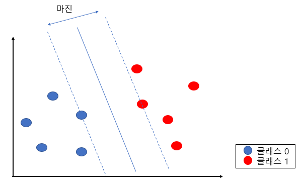

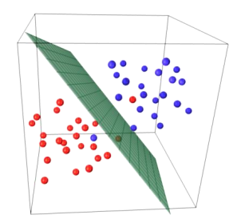

SVM은 선형과 비선형으로 나뉘는데 선형분리가 가능하면 선형 SVM,
불가능하면 비선형 SVM이라 불린다. 선형 SVM은 최대마진의 초평면을 찾는
하드마진과 어느 정도의 오분류를 허용하는 소프트마진으로 나뉜다.
하드마진의 목적함수는 다음과 같다.

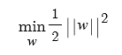

\*w는 가중치를 의미

소프트마진에선 오분류를 허용하고 이를 고려하기 위해 슬랙 변수(slack
variable)를 사용한다. 슬랙 변수의 크기만큼 초평면 위, 아래로 오차를
허용한다. 슬랙 변수를 추가한 목적함수는 다음과 같다.

$$\min_{w}\frac{1}{2}\left\| w \right\|^{2} + C\sum_{i = 1}^{n}{\varepsilon i}$$

C(cost)라는 파라미터를 통해 슬랙 변수의 총합에 한계를 줌으로써 조정할 수
있다. C가 커지면 오류를 허용하지 않고 마진이 줄어들어 오류가 적지만
과적합의 위험이 생기며, C가 작아지면 마진이 크고 오류가 증가하고
과소적합의 위험성이 생길 수 있다.

비선형분리는 선형분리가 불가능한 공간을 선형분리가 가능한 고차원
특성공간으로 보내 선형분리를 진행한다. 그 후 다시 기존의 공간으로
변환하여 비선형 분리를 진행한다. 입력공간을 변환하기 위해 아래처럼
표현할 수 있는 매핑(mapping) 함수를 사용하게 된다.

$$\Phi(x) = Ax$$

하지만 고차원으로 갈수록 계산량이 어마어마하게 커진다는 단점이 있는데
이를 해결하고자 나온 것이 커널트릭이다. 커널함수의 종류는 기본적으로
선형(linear)을 사용하고 그 외에는 다음과 같다. (류태욱, 2001).

$$Polynomial:k(x,y) = \left( 1 + x^{T}y \right)p$$

$$Radial\ basis\ function:k(x,y) = e^{\frac{- \left\| xi - xj \right\|^{2}}{2\sigma^{2}}}$$

$$Signomial:\ k(x,y) = tanh(kxixj - \delta)$$

### 랜덤 포레스트(Random Forest)

랜덤 포레스트 모델은 의사결정 트리(Decision Tree)의 과적합 한계를
극복하기 위해 발표된 앙상블 머신러닝 모델이다. 의사결정 트리는 관측값과
목표값을 연결하는 데 있어 논리적 명제를 여러 개 생성하는 방식으로 트리를
구축한다.

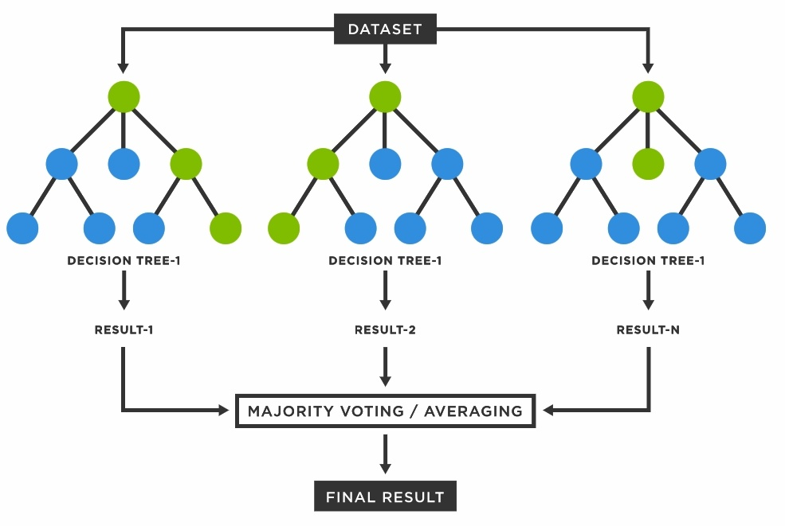

의사결정 트리는 원리와 사용이 간단하여 수행 시간이 짧지만 트리의 깊이에
따라 과적합(overfitting)의 문제가 발생할 수 있다. 랜덤 포레스트 모델은
이런 문제를 극복하기 위해 배깅(Bagging)과 앙상블(Ensemble) 프로세스를
이용한다. 배깅은 학습 데이터 세트에서 임의로 하위 데이터 세트를 추출하여
의사결정 트리를 만드는 과정이다. 이때 트리를 만들 때 사용될 속성들을
제한함으로써 각 트리에 다양성을 준다. 전체 속성 개수의 제곱근만큼
선택하는 것이 가장 좋은 방법이다. 앙상블 학습법이란 다수의 학습
알고리즘을 사용하여 예측하는 방법을 의미한다 (김재환 & 이민구, 2018).

### 철강 표면 검사

압연 공정 중 표면을 검사하는 장치인 SDD(Surface Defect Detector)는 빠른
속도로 진행중인 표면에서 결함을 정확하고 신속하게 검출해야 한다.
현재까지의 철강 표면 검사 공정에서의 SDD 연구는 SVM을 활용하여 포스코의
표면 결함 검사 시스템의 정확도를 평균 90%까지 상승한 사례 (ChoiKeesug,
KooKyungmo, LeeJin, 2006), 신경망 학습을 활용하여 냉연강판의 표면결함
분류에서 평균 90%의 정확도를 보인 연구 (문창인, 최세호, 주원종, 김기범,
김철호, 2007), 등이 있다.

## 차별성 및 우수성

생산부품의 결함 검출은 모든 공장에서 필수적인 요소이다. 기존의 불량품
검출 방법은 시간이 상대적으로 오래 걸리고 검출 오차율이 높았다. 특히
천연가죽 같은 형태가 비정형화되어 있는 분야에서는 더욱더 기계가 잡아내기
어려워 육안검사에 의존하는 경우가 대부분이었다 (송민근, 2017). 위의
김성진 등의 연구에 따르면, 검사 공정에서 딥러닝 모델이 적용된 공장의
경우, 사람의 육안으로 확인하기 어려운 결함을 빠르게 검출할 수 있게
되었을 뿐만 아니라 전체적으로 품질을 약 44% 향상시키는 등 큰 발전을
보였다. 이렇듯 제조공정의 검사 공정에서의 인공지능 도입은 생산성 향상에
지대한 영향을 끼친다. 본 논문에서는 딥러닝 모델을 실제 공장에 적용했을
때의 성능을 확인하기 위해 여러 딥러닝 모델을 이용해 이미지 기반 불량품
검출 실험을 진행하였다. 본 연구는 많은 모델 중에서도 적은 데이터로도
좋은 성능을 낼 수 있는 EfficientNet을 주 모델로 선택하였다.
EfficientNet은 적은 파라미터로도 높은 정확도를 가지는 CNN계열 모델이다.
따라서 방대한 데이터셋을 얻기 힘든 현실에서 다른 모델들보다 뛰어난
성능을 기대한다. 이에 따라 본 논문은 EfficientNet과 다른 모델과의
성능비교를 통하여 실제로 검사 공정에 적용하기 위한 성능 평가를 진행한다.

# 문제정의

본 절에서는 대상 시스템인 열간 압연 공정과 표면 결함 검출 시스템, 그리고
본 연구에서 활용한 머신러닝을 이용한 이미지 분류를 살펴본다.

## 머신러닝을 활용한 이미지 분류

이미지 분류 문제란, 입력 이미지를 미리 정해진 카테고리 중 하나인 라벨로
분류하는 문제이다. 딥러닝 이전에도 이미지를 분류하기 위한 다양한
시도들이 있었다. 대표적으로 특정 규칙을 이해하고, 그것이 '존재한다는
정보'를 얻는 알고리즘을 만들어 이를 통해 이미지가 무엇을 나타내는지
알아내는 방법인 규칙기반방법(Rule-based approach)이 있다. 이 방법은
특정한 규칙(아이디어)를 포착하고 이를 if-then-else 등의 조건들로
분류하는 방식이다. 이 규칙기반 시스템은 학습능력이 없기 때문에 가장 단순
형태의 AI로 간주된다. 하지만 이 방법의 문제점은 개와 고양이처럼 구조가
비슷한 이미지를 같이 분류한다는 등 불안정하다는 단점과, 규칙이 비슷한
이미지들을 다르게 분류하려면 다른 규칙을 지속적으로 추가해야 하는
확장성이 떨어진다는 단점이 있다.

이러한 문제를 해결하기 위해 제시된 것이 데이터 기반 방법(Data-driven
approach)이다 (Stanford Vision and Learning Lab, 2020). 이 방법은 사람이
직접 알고리즘을 만들어 입력하는 것이 아니라 데이터 기반 모델을 만들어
문제를 해결하고자 하는 방법이다. 데이터 기반 모델을 데이터셋을 통해
모델을 학습시키는데, 이를 머신러닝이라고 한다. 이렇게 학습된 머신러닝
모델은 이미지를 입력값으로 받아 이미지의 레이블을 예측한다.

머신러닝은 학습 방법에 따라서 크게 지도학습과 비지도학습으로 분류될 수
있다. 지도학습은 정답을 알려주며 학습시키는 것이라 할 수 있다. 입력과
출력 데이터가 있고 주어진 입력으로부터 출력을 예측할 때 사용한다.
지도학습에는 분류(classification)과 회귀(regression)이 있다. 분류는 미리
정의된, 가능성 있는 여러 클래스 레이블 중 하나를 예측하는 것이다. 분류는
클래스의 레이블 별로 다른 정보를 의미해서 출력값에 연속성이 없는 반면,
회귀는 연속적인 숫자를 예측하는 것이기 때문에 여기서 차이점이 있다.
비지도학습은 정답을 알려주지 않고 비슷한 데이터들을 군집화하는 것이다.
대표적인 종류는 Clustering, Hidden Markov Model 등이 있다. 본 논문에서는
이미지를 사용하여 금속 표면 결함 검출을 하여 지도학습의 분류 모델들을
사용하였다.

이런 머신러닝 모델의 성능을 높이는 방법은 네트워크의 깊이를 깊게 만드는
것, 채널의 폭을 늘려 미세한 정보를 더 많이 담는 것, 입력 이미지의
해상도를 높이는 것으로 총 세 가지가 있다. EfficientNet은 이 세 가지의
최적의 조합을 찾은 모델로 뛰어난 성능을 보여준다.

## 열간압연(열연) 공정

철강이란 주철(Iron)과 강철(Steel)을 합쳐서 부르는 말이다. 철에 포함된
탄소 함유량을 기준으로 주철과 강철을 나누는데, 탄소가 많이 함유될수록
주철이며 단단하고 가공성이 약하다는 특징이 있고, 탄소가 적을수록
순철(pure Iron)에 가까워지는 강철이며 늘어나고 가공성이 우수하다는
특징이 있다. 철강제조는 원재료인 철광석을 사용하여 선철(Pig Iron)을
만들고, 탄소를 포함한 다양한 성분을 적정범위로 정제하여 강철을 만드는
과정이다.

철강제품은 최종산업 제품에 쓰이기 위한 소재로 만들어지며, 형태에 따라
판재, 봉형강, 강관 등의 제품이 있다. 판재는 두께에 따라 박판(얇은
강판)과 후판(두꺼운 강판)으로 크게 나눌 수 있고 박판은 코일(coil)
형태로, 후판은 플레이트(Plate) 형태로 생산된다. 자세한 철강의 제조
공정은 다음과 같다.

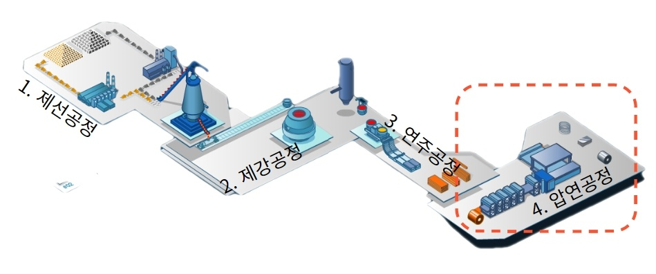

본문은 철강의 제조 공정 중 압연에 해당하는 과정 중 발생하는 결함에 대해
연구하였다. 압연공정(Rolling)은 200\~400mm 두께의 슬라브 소재를 두 개의
롤러 사이를 통과시키며 고객 요구 두께로 가공하는 공정이다. 열간 상태에서
압연하는 열연 공정(1차 압연), 상온에서 압연을 실시하는 냉연 공정(2차
압연)이 있다. 선공정에서의 품질 결함을 검출하지 못하고 후공정으로
보내지는 소재는 후공정에서 품질 악화, 설비 사고로 이어질 수 있어서 품질
결함 검사는 매우 중요하다.

-   열간 압연(1차 압연)

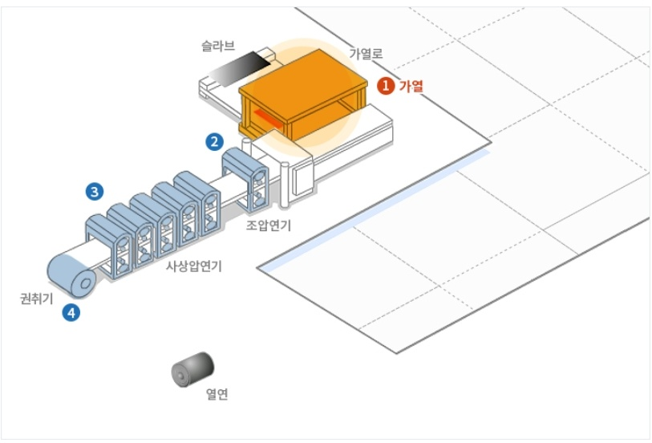

1)  가열: 이송된 슬래브를 가열로에서 충분히 가열한 후 추출하여
    압연작업을 한다. 열간상태의 슬래브(Slab)표면에 생성된 두꺼운
    스케일을 제거하기 위해 세정 장비인 스케일 브레이커를 사용한다.

2)  조압연: 스케일이 제거된 슬래브(Slab)를 적당한 형상과 두께, 폭을 갖춘
    압연소재로 만드는 공정이다. 압연기의 입측과 출측에 날이 설치되어
    AWC(Automatic Width Control)의 적정폭 제어에 따라 폭 방향으로
    압연한다.

3)  사상압연: 판을 정해진 두께와 폭으로 조절하고 용도에 맞는 마무리
    온도에서 양호한 표면, 형상으로 압연하는 공정이다. 현재 포스코는 최신
    설비인 Work Roll Shift 설비와, Pair Cross Mill, ORG(On-Line Roll
    Grinding)설비는 판형상(Crown)을 제어하여 생산성과 품질 향상에
    기여하고 있다.

4)  Run-Out Table과 권취(Coiling): 마무리 압연을 끝낸 강판은 Run-Out
    Table을 거쳐 권취기에서 권취된다. 권취란 코일이나 로프 형태처럼
    둥글게 말거나 감는 공정이다. 이 Table Roll상의 강판은 냉각수
    스프레이에 의해 일정한 권취 온도까지 내려간다.

5)  정정: 정정공정에서는 제품의 형상, 기계적 성질 및 표면 형상의 개선을
    위해 표면 결함, 형상 및 치수측정 등의 각종 검사를 실시한다.

-   냉간압연(2차 압연)

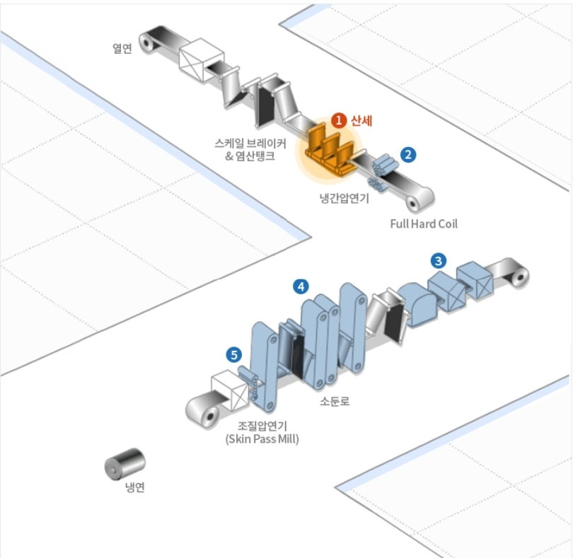

1)  산세: 산세공정은 열연코일을 스케일 브레이커 및 염산탱크에 통과시켜
    최종 냉연제품의 표면 결함의 원인인 산화물 피막을 제거하는 공정이다.

2)  냉간압연: 용도에 맞는 두께와 재질확보를 위해 통상 40\~90%의 압하율로
    진행되며, 자동 두께 제어, 자동 형상 제어 등의 첨단 제어 기기를
    이용한다.

3)  전해청정: 소둔에 앞서 냉연코일을 알칼리 용액에 통과시켜 기계적,
    화학적 반응을 통해 압연유와 오염물질을 제거하는 공정이다.

4)  소둔(열처리): 급속가열 및 급속냉각을 통해 심가공용(Deep Drawing
    Quality)에서 고장력강(High Tensile Steel)까지 생산하는 생산성이
    뛰어난 제조방법으로써 연속소둔과 상자소둔 방법을 이용한다.

5)  조질압연: 스트레처 스트레인 등의 결함을 판위에 약 1% 정도의 압하를
    가하여 제거하고 적당한 조도를 부여하여 미려한 표면의 제품으로
    생산한다.

6)  정정: 생산의 최종공정으로 고객이 원하는 사이즈로 맞추어 제품의
    결함검사 및 용도 적합 여부를 판단한다.

    3.  ## 표면 결함 검출 시스템

압연 공정 중 표면을 검사하는 장치를 SDD(Surface Defect Detector)라고
한다. 제조 공정 중 발생되는 표면 결함은 검출-분류-평점산출을 거쳐 품질
기준 만족 여부에 따라 정품 혹은 불량으로 최종 판정된다. 우선
이미지데이터로 결함이 발생한 부분을 검출하여 어느 결함에 속하는지
분류한다. 그리고 결함 정도에 따라 평점을 산출한 후 최종 판정을 거쳐
불량인지 아닌지를 판별한다. 논문에서는 열연공정에서의 대표적인 결함을
Crazing, Inclusion, Patches, Pitted surface, Rolled-in Scale, Scratches
6개로 분류하였다. 각 레이블에 대한 예시는 아래와 같다.

\<그림\> 표면 결함 이미지 데이터셋

4.  # 접근방법

    1.  ## 서버 환경

본 논문은 Efficientnet의 성능을 알아보기 위해 약 1800개의 금속 표면
이미지 데이터를 이용해 금속 표면 결함 검출 자동 시스템을 구축하였다.
개발 환경은 구글에서 제공하는 Colab 환경, 그리고 Tensorflow를 사용하며
Colab 서버의 스펙은 다음과 같다.

-   CPU: Intel(R) Xeon(R) CPU @ 2.30GHz

-   GPU: Nvidia Tesla T4

-   GPU Memory: 15109MiB

    1.  ## 성능 평가 지표

EfficientNet, Vision Transformer, Support Vector machine, Random Forest
4가지 모델에 대한 성능 비교를 진행하였다. 이 때, 각 모델의 성능을
평가하기 위해서accuracy, precision, recall, F1-Score의 성능 평가 지표를
활용하였다. 모델의 성능이 좋다는 것은 이 4가지 수치를 복합적으로 비교,
고려할 때 수치가 상대적으로 높다는 것을 말한다. 4개의 성능 지표는 다음과
같다.

$$Accuracy = \ \frac{True\ Positive + True\ Negative}{True\ Positive + False\ Positive + True\ Negative + False\ Negative}$$

$$Precision = \ \frac{True\ Positive}{True\ Positive + False\ Positive}$$

$$Recall = \ \frac{True\ Positive}{True\ Positive + False\ Negative}$$

$$F1\ Score = \ \frac{2}{\frac{1}{Precision} + \frac{1}{Recall}}$$

True Positive -- 모델은 입력 값에 대한 출력 값을 *Label 1*이라고
예측하였고 실제로 그러한 경우

True Negative -- 모델은 입력 값에 대한 출력 값을 *Label 1*이 아니라고
예측하였고 실제로 그러한 경우

False Positive -- 모델은 입력 값에 대한 출력 값을 *Label 1*이라고
예측하였지만 실제로는 1이 아닌 경우

True Negative -- 모델은 입력 값에 대한 출력 값을 *Label 1*이 아니라고
예측하였지만 실제로는 1이 맞는 경우

## 하이퍼파라미터

각 모델별로 아래와 같은 하이퍼파라미터 값들을 조절하며 모델을
생성하였다.

### Efficient Net

1)  Hyperparameters

-   Input size(Image size): 이미지 데이터를 입력값으로 넣을 때, 입력
    크기(해상도)를 결정하는 변수이다. EfficientNet같은 경우에는 (B0, B1,
    B2, ... B7)까지 최적의 조합으로 모델을 구성하여 이미지 사이즈가 모델
    선택 시에 결정된다. 본 연구에서는 원본 이미지의 해상도가
    200×200이었기 때문에, EfficientNet 적용 시에는 224×224로 resize를
    진행한 뒤, 224를 Input size로 가지는 B0 모델을 선택하였다.

-   Buffer size: Tensorflow에서 Buffer size개로 이루어진 버퍼로부터
    임의로 샘플을 뽑으며, 샘플을 뽑은 뒤에 그 샘플은 다른 샘플로
    대체한다. 완벽한 Shuffle을 위해서는 전체 데이터셋의 크기에 비해
    크거나 같은 버퍼 크기가 요구되나, 학습에 사용되는 이미지 데이터의
    양이 많은 경우 하드웨어의 한계가 있을 수 있기 때문에 buffer size를
    적절한 수준으로 설정해야 한다.

-   Batch size: 메모리의 한계와 속도 저하 때문에 대부분의 경우에서 한
    번의 epoch에 모든 데이터를 활용할 수는 없다. 그렇기 때문에 데이터를
    나누어서 학습을 진행하게 되는데, 배치 사이즈란 한 번의 batch마다
    주는 데이터 샘플의 사이즈이다. 배치 사이즈 가 너무 큰 경우에는 한
    번에 처리해야 할 데이터의 양이 많으므로 연산량이 많아져 학습 속도가
    느려지고 메모리 부족 문제가 발생할 위험이 있다. 반대로 배치 사이즈가
    너무 작은 경우 적은 데이터를 대상으로 가중치를 자주 업데이트 하게
    되므로 훈련이 불안정해질 수 있다.

-   Epoch: 전체 데이터셋에 대해 학습을 완료하는 횟수. 신경망에서
    사용되는 역전파 알고리즘(backpropagation algorithm)은 파라미터들을
    사용하여 입력부터 출력까지 각 계층의 weight을 계산하는 순방향
    패스(forward pass)를 거친 뒤에, 다시 반대로 거슬러 올라가며 기존
    weight 값들을 수정하는 역방향 패스(backward pass) 과정을 거친다.
    이러한 과정을 한 번 완료하면 한 번의 epoch가 진행되었다고 볼 수
    있다.

-   Learning rate: Cost Function에서 특정 가중치 값인 행렬 W가 주어졌을
    때, 기울기에 learning rate를 곱해서 그 다음 가중치 값을 결정하게
    된다. Learning rate가 큰 경우에는 w값이 수렴하지 않고 발산해 버릴 수
    있고, 작은 경우에는 너무 많은 반복을 수행해야 해 학습 속도가
    지나치게 느려지므로 적절한 learning rate 값을 찾아야 한다.

2)  Optimizer

    -   Adam: 각 파라미터마다 다른 크기의 업데이트를 진행하는 방법이다.
        Adam은 극소점의 탐색을 위해 속도를 줄이고자 한다. 그리고
        decaying average of squared gradients를 저장할 뿐만 아니라 과거
        gradient $m_{t}$의 decaying average도 저장한다.

$$m_{t} = \beta_{1}m_{t - 1} + \left( 1 - \beta_{1} \right)\nabla_{\theta}J(\theta)$$

$${v_{t} = \beta_{2}v_{t - 1} + \left( 1 - \beta_{2} \right)\left( \nabla_{\theta}J(\theta) \right)}^{2}$$

2)  Augmentation

-   Random Rotation(factor=0.15)

-   Random Translation (height_factor=0.1, width_factor=0.1)

-   Random Flip

-   Random Contrast(factor=0.1)

    1.  ### Vision Transformer

1)  Hyperparameters

-   Seed: 모델 생성시에 shuffle()과 같이 랜덤으로 구성하는 요소들을 다시
    진행할 때도 같은 값이 나오게 하기 위해 고정해주는 값이다.

-   Weight decay: weight decay는 학습된 모델의 복잡도를 줄이기 위해 학습
    중 weight 이 너무 큰 값을 가지지 않도록 Loss function에 패널티로서
    작용하는 것이다. Weight decay를 적용하는 경우 overfitting문제를
    해결하는 데 도움이 된다.

-   Input size (Image size): 이미지 데이터를 입력값으로 넣을 때, 입력
    크기(해상도)를 결정하는 변수이다. 기본적으로 해상도가 클수록 많은
    정보를 담을 수 있고, 모델의 성능이 좋아지지만 계산량이 많아져 학습
    시간이 길어진다. 기존 이미지 해상도가 200×200으로 크지 않기 때문에,
    높은 성능을 위해 Input size는 200으로 고정시키고 진행하였다.

-   Epoch

-   Batch size

-   Buffer size

2)  Optimizer

    -   AdamW: weight decay는 loss function에 L2 regularization을
        추가하여 구현할 수 있으며 Adam은 파라미터마다 학습률을 다르게
        적용하여 L2 regularization로 weight decay를 구현한다면 동일하지
        않아 성능이 하락한다. AdamW는 이를 해결하기 위해 weight decay를
        분리하여 따로 구현한다.

3\) Augmentation

-   Normalization

-   Random Flip(\"horizontal\")

-   Random Rotation(factor=0.02)

-   Random Zoom (height_factor=0.2, width_factor=0.2)

    1.  ### SVM

1)  Hyperparameters

-   Input size (Image size)

-   C: C가 커질수록 이상치의 존재 가능성을 낮게 보고, C가 작아질수록
    이상치의 존재 가능성을 높게 본다. 즉, decision boundary의 곡률을
    결정한다고 볼 수도 있다.

2)  Kernel

-   RBF Kernel

-   Polynomial Kernel

-   Sigmoid Kernel

-   Gaussian Kernel

    1.  ### Random Forest

1)  Hyperparameters

-   Seed

-   Input size (Image size)

-   max_depth: Random forest에서 각 결정 트리의 최대 깊이를 뜻한다.
    tree의 깊이가 과도하게 깊은 경우에는 과적합이 일어나 테스트
    데이터셋에 대해서 정확도가 낮아질 수 있다.

-   n_estimators: 결정 트리의 개수이다. 일반적으로 결정 트리의 개수가
    많으면 좋은 성능을 기대할 수 있지만 계속해서 증가시킨다고 무조건
    성능이 향상되지는 않는다. 또한 트리의 갯수에 비례하여 계산량이
    많아져 학습 수행 시간이 증가한다.

-   min_samples_leaf: 리프 노드가 되기 위한 최소한의 샘플 데이터 수이다.

-   min_samples_split: 노드를 분할하기 위한 최소한의 데이터 수이다.

5.  # 연구결과

    1.  ## EfficientNet

EfficientNet은 resolution, depth, width 세 가지 스케일링 기법을 사용하여
성능을 올리는 모델이다. 기존 논문 조사를 통해 depth와 width보다
resolution을 키우는 것이 정확도가 더 높은 것을 알 수 있지만,
resolution이 높아지면 이미지를 처리하는 신경망의 깊이도 깊어져야 하고 더
많은 channel이 필요하기 때문에 세 가지 요소를 동시에 고려하는 게 가장
좋다. EfficientNet을 이용할 때 파라미터에 대한 결정은 여러 요인의 영향을
받을 수 있다. EfficientNet는 이미지의 해상도에 따라 모델이 B0부터 B7까지
나뉜다. 해상도는 8 또는 16의 배수여야 하는 특징이 있는데 그렇지 않으면
layer boundary에서의 zero-padding이 computation resource를 많이 잡아먹을
수 있기 때문이다. 본 연구에서 활용하는 데이터는 200×200의 비교적 작은
이미지로 이루어진 데이터셋이기 때문에 224×224 사이즈로 resize를 진행한
뒤 B0모델로 진행하였다. B0 모델의 기본 구조는 아래와 같다.

\<표\> EfficientNet B0 구조

EfficientNet B0 모델을 기반으로 Epoch 100에 대하여 모델 fitting을
진행하였다. 그 후 미세조정(Fine Tuning)을 통해 모델을 개선했다.
미세조정이란 기존에 학습되어져 있는 모델을 기반으로 아키텍쳐를 새로운
목적에 맞게 변형하고 이미 학습된 모델 Weights 로부터 학습을 업데이트
하는 방법을 말한다. 우선"ImageNet"데이터셋을 통해 사전학습된 weights를
freeze 시켰다. Model.trainable을 False로 설정하여 모델의 모든 하위
레이어를 동결시켜 훈련 불가능 상태로 전환하였다. 이는 훈련 중 가중치가
더는 업데이트되지 않는다는 것을 의미한다. 가장 성능이 좋았던 모델 중
하나인 {Batch size: 16, Shuffle Buffer size: 128, Epoch: 100, Optimizer:
Adam, Learning Rate: 1e-2}를 기준으로 미세 조정을 Epoch 60으로 실행한
결과 평균 정확도가 97.11%에서 98.97%로 상승한 것을 볼 수 있었다. 초기
학습과 미세 조정의 epoch-accuracy 그래프는 다음과 같다.

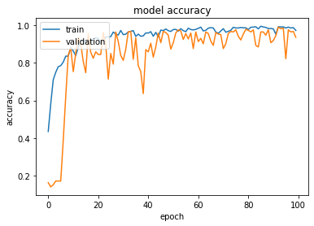

\<그래프\> 초기 학습의 epoch-accuracy 그래프

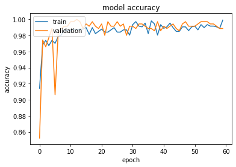

\<그래프\> 미세 조정의 epoch-accuracy 그래프

그리고 동결을 해제(Unfreeze)하면 학습 속도가 낮아진 전체 모델을
전체적으로 재훈련할 수 있다. 동결 모델의 상위 층 20개를 동결에서
해제하고 모델에 새로 추가한 층과 함께 훈련한다. 모델을 빌드한 후에
가중치를 불러오고 레이어를 동결해제 시켜주었다. 그 결과 평균 99.72%의
최종 정확도가 나왔다.

EfficientNet이 적은 파라미터 값을 가지고도 좋은 성능을 보이는 이유는
다음과 같다. 앞서 언급했듯이 EfficientNet을 포함한 CNN 모델 크기를
키우는 방법은 네트워크의 깊이, 너비, 해상도를 조정하는 방식이 있다.
지금까지의 연구는 하나의 파라미터를 스케일링하며 휴리스틱하게 모델
성능을 평가하였다. EfficientNet에서는 이러한 모델 스케일링 기법을
중점으로 다뤄 세 가지 파라미터 사이의 밸런스를 고정된 상수로
스케일링하는 Compound 방법을 진행한다. 이는 데이터가 커지면 더 큰 모델
용량(capacity)이 필요하다는 기존 연구 관점에서 합리적이다. 결과적으로
EfficientNet이 기존 모델들보다 적은 파라미터로 좋은 성능을 보인다. 각
하이퍼파라미터별 결과값은 다음과 같다.

  ----------------------------------------------------------------------------------------
|      |**Resolution(Input size)** |**Batch**   |**Shuffle Buffer size** | **Epoch** |  **Optimizer** |  **learning rate**|
|----|--------| ---------------| ---------------| ---------------| ---------------|-------|
  |**1**    |**EfficientNET B0(224×224)** |  **8**    | **128**    | **100**    | **Adam**    |  **1e-2**|
  |**2**    |                | **16**    |**30**      | **128**    |          |             |          |
  |**3**    |                | **16**    |**64**      | **128**    |          |             |          |
  |**4**    |                | **16**    |**128**     | **128**    |          |             |          |
  |**5**    |               |  **16**    |**300**     | **128**    |          |             |          |
  |**6**    |               |  **32**    |**128**     | **128**    |          |             |          |
  |**7**    |               |  **32**    |**300**     | **128**    |          |             |          |
  |**8**    |               |  **64**    |**30**      | **128**    |          |             |          |
  |**9**    |               |  **64**    |**128**     | **128**    |          |             |          |
  |**10**    |              |  **128** |  **128**     | **128**    |          |             |           |  

\<표\> EfficientNet 모델의 각 Hyperparameter 값

  ------------------------------------------------------------------------
  |         |**Accuracy**    |**Precision**   |**Recall**    |  **F1-Score**|
  |--------| ---------------| ---------------| ---------------| ---------------|
  |**1**   | **0.9833**    |  **0.9843**    |  **0.9833**    |  **0.9833**|
  |**2**    |**0.9954**    |  **0.9955**    |  **0.9954**    |  **0.9954**|
  |**3**    |**0.9870**    |  **0.9876**    |  **0..9870**    | **0.9870**|
  |**4**    |**0.9972**    |  **0.9973**    |  **0.9972**    |  **0.9972**|
  |**5**    |**0.9806**    |  **0.9825**    |  **0.981**    |   **0.981**|
  |**6**    |**0.9917**    |  **0.9918**    |  **0.9917**    |  **0.9916**|
  |**7**    |**0.9917**    |  **0.9919**    |  **0.9917**    |  **0.9917**|
  |**8**    |**0.9870**    |  **0.9876**    |  **0..9870**    | **0.9870**|
  |**9**    |**0.9954**    |  **0.9955**    |  **0.9954**    |  **0.9954**|
  |**10**  | **0.9972**    |  **0.9973**    |  **0.9972**    |  **0.9972**|  ------------------------------------------------------------------------

\<표\> EfficientNet 각 모델의 accuracy, precision, recall, f1-score

본 연구에서 EfficientNet 모델 학습을 진행할 때 전처리로 무작위 요소들을
집어넣었기 때문에 학습을 진행할 때마다 미세하게 결과 값이 달라지긴
하였으나, Batch size를 8, 16, 32, 64, shuffle buffer size를 8, 30, 64,
128, 300으로 진행하였을 때 전체적으로 성능이 98\~99%로 좋게 나왔다.
Shuffle buffier size를 높게 가져갈 경우에 shuffle이 더 잘 되어 모델이 더
좋은 성능을 보일 것으로 기대하였다. 실제로도 buffer size가 커질수록
모델의 성능이 올라가는 완전한 경향성은 보이지 않았지만, 대체로 buffer
size가 작을 때보다는 클 때 높은 성능을 보였다. 반면에, 한 번에 학습에
참여하는 데이터의 수를 결정하는 batch size에 따른 경향성은 크지 않았다.
물론 batch size가 8로 작을 때는 한 번의 학습을 진행할 때 데이터의 양이
적어 데이터들의 패턴을 익히기에 충분하지 않아 상대적으로 낮은 정확도를
보였지만, batch size가 16을 넘어가게 되면 전체적으로 비슷한 성능을
보였다. 배치가 커질 때 학습에 참여하는 이미지의 수는 많아진다. 하지만
결함 검사 특성 상 같은 레이블 내에 비슷한 패턴을 보이는 이미지들이 많기
때문에 학습에 참여하는 이미지의 수가 많아지는 것이 모델이 패턴을 더 잘
분류할 수 있도록 학습하는데 유의미한 경향성을 주지 않는다고 판단된다.
그렇기 때문에 배치 사이즈가 16, 128일 때 두 경우에서 가장 좋은 결과가
나왔다.

## Vision Transformer

ViT는 데이터의 양이 많을수록 좋은 성능을 보인다. ViT 모델은 convolution
없이 순수 transformer 구조만을 이용한다. 트랜스포머 구조는 어떤
귀납편향(Inductive Bias)도 모델에 주입하지 않는다는 특징이 있다. 기존에
이용한 일반적인 딥러닝 모델들은 데이터의 입력값이 조금만 바뀌어도 결과가
바뀌거나, 데이터 본연의 의미를 학습하는 것이 아닌 결과와 편향을 학습하게
되는 일반화 오차(Generalization problem)라는 문제점이 있다. 이를
해결하기 위해 귀납편향을 이용하게 되는데 이는 학습 시 보지 못한 입력에
대한 출력을 예측하기 위해 사용하는 추가적인 가정을 의미한다.
귀납편향으로써 트랜스포머에는 convolution 기반 모델에 내재되어 있는
translation equivariance나 지역성 같은 성질이 부족하다. 하지만 충분한
양의 데이터는 귀납편향의 필요성을 감소시킨다. 따라서 충분히 큰 데이터에
사전훈련을 진행하면 기존 SotA 모델들보다 더 뛰어난 성능을 보인다.

많은 양의 데이터셋을 다루지 않는 본 연구에서와 같이 작은 데이터에서도
학습이 가능하며 다양한 ViT task에 적용 가능한 SPT(Shifted Patch
Tokenization)와 LSA(Localty Self-Attention) 모듈을 사용하였다.

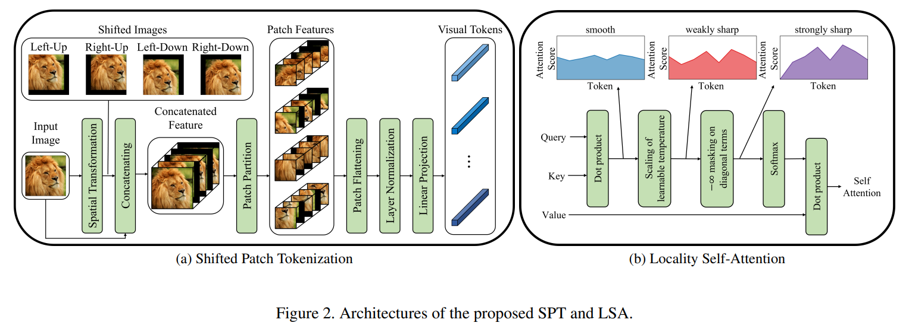
\<그림\> 제안된 SPT와 LSA의 구조

SPT를 통해 더 많은 공간 정보를 시각적 토큰(visual token)에 임베딩하여
ViT의 귀납편향을 증가시킬 수 있고, LSA를 통해 ViT의 어텐션을 local로
집중시킴으로도 귀납편향을 증가시킬 수 있다. 그 결과 가장 좋은 성능을
보인 모델이었던 {Buffer size:256, Batch size:64, Patch size:10, Learning
Rate:0.001}기준으로 97.5%라는 좋은 성능을 보였다. 각 하이퍼파라미터별
결과값은 다음과 같다.

|  | **Resolution(Input size)**   |**Seed**| **Buffer size**  | **Batch size**       | **Epoch** | **Optimizer**     | **Learning rate** |
|---|---------|-|-----|----------|--------|------------|------|
|1| **200×200**|430| **128** | **64**  |**200**| **10**  | **0.001** |
|2|          || **128** | **64**  |        | **10**  | **0.001**    |
|3  |          |  |    **128** | **128**| | **10**    |**0.0001**    |
| 4 |          |  | **128** | **64**  || **10**    | **0.001**    |
| 5 |          |  |  **256** | **64**  || **20**         | **0.001**   |
| 6 |          |  |  **256** | **64**  || **20**         | **0.0001**   |
| 7 |          |  |  **256** | **64**  || **40**         | **0.001**   |
| 8|          |  | **256** | **128** || **20**         | **0.001**   |
|9 |          |  |**256** | **256** || **20**         | **0.001**   |
|10 |          |  | **512** | **64**  || **20**         | **0.001**   |

\<표\> Vision Transformer 모델의 각 Hyperparameter 값

  --------------------------------------------------------------------------
 |**Accuracy**    | **Precision**    |**Recall**    |**F1-Score**|
 |----------------| ----------------| ------------- |-----------------|
  |**1**    |**0.9750**    |   **0.9755**    |   **0.9750**    |**0.9750**|
  |**2**    |**0.9611**    |   **0.9613**    |   **0.9611**    |**0.9610**|
  |**3**    |**0.9361**    |   **0.9363**    |   **0.9361**    |**0.9359**|
  |**4**    |**0.9694**    |   **0.9694**    |   **0.9694**    |**0.9693**|
  |**5**    |**0.967**    |    **0.967**    |    **0.967**    | **0.967**|
  |**6**    |**0.9555**    |   **0.9567**    |   **0.9555**    |**0.9554**|
  |**7**    |**0.9361**    |   **0.9364**    |   **0.9361**    |**0.9359**|
  |**8**    |**0.9528**    |   **0.9538**    |   **0.9528**    |**0.9529**|
  |**9**    |**0.9444**    |   **0.9446**    |   **0.9444**    |**0.9444**|
  |**10**   |**0.9472**    |   **0.9500**    |   **0.9472**    |**0.9470**|  --------------------------------------------------------------------------

\<표\> Vision Transformer 각 모델의 accuracy, precision, recall,
f1-score

본 연구에서 ViT 모델 학습을 진행할 때도 EfficientNet과 마찬가지로
전처리에 무작위 요소들을 집어넣었기 때문에 학습을 진행할 때마다 1%p
내외로 미세하게 정확도 값이 달라졌다. 하지만 대체로 93%\~97%대의 준수한
성능을 보였다. ViT는 이미지의 개수가 많을 때 상대적으로 좋은 성능을 낼
수 있는 모델이기 때문에 클래스 당 300장만의 이미지를 활용하였을 때
EfficientNet에게 상대적으로 부족한 성능을 보였다.

각 하이퍼파라미터별 영향을 분석해보자면, 학습률(learning rate)은 0.001이
적합해 보였다. 학습률을 0.0001로 작게 하였을 경우에는 학습의 수렴이
적절하게 이루어지지 않아 정확도가 감소하는 경향을 보였다. 또, Buffer
size를 (128, 256, 512)의 범위에서 조절할 때는, 대체적으로 Buffer size가
커질수록 정확도가 오히려 감소하는 경향을 보였다. 이는 EfficientNet에서와
마찬가지로 이미지의 개수가 많지 않아 128 이상이면 충분히 커 유의미한
차이를 발생시키지 않는다고 판단된다. Batch size 역시 크게 유의미한
차이를 발생시키지 않았다. 반면, ViT 모델에서 학습에 다뤄지는 단위로서
중요하게 다뤄지는 patch size는 작을수록 성능이 높은 결과를 보였다. 다만
patch size가 작아질수록 차지하는 메모리와 계산량이 급격하게 많아진다.
이에 본 연구의 실험 환경에서는 patch size를 10까지 낮출 수 있었다.

위와 같은 것을 종합적으로 고려해보았을 때 하드웨어가 충분하다면 patch
size를 작게 해보는 것이 모델의 성능을 향상시키는 데 유의미할 수 있다.
또, Buffer size와 Batch size는 너무 작지 않다면 성능에 크게 영향을
미치지 않는다는 것을 알 수 있었다. 다만 여러 번의 시행을 통해서 최적의
성능을 도출하는 값을 찾아야 한다는 것에는 변함이 없다.

## SVM

SVM(Support Vector Machine)은 학습데이터를 분류하기 위한 결정 경계, 즉
기준선을 정의하는 모델이다. 이때 데이터의 속성이 늘어나 차원이 늘어날
때는 선 대신 초평면(Hyperplane)을 생성하고, 두 개 이상의 데이터 집단을
구분하는 최적의 초평면(Optimal Hyperplane)을 찾는 알고리즘이다. SVM은
GPU를 통한 학습을 지원하지 않기 때문에, RAM과 계산량의 문제로 이미지
크기를 150×150으로 resize하여 진행하였다.

먼저 SVM의 하이퍼파라미터 중 C를 변경시키며 실험을 진행하였다. C는
굴곡을 결정하는 매개변수라고 볼 수 있다. C를 통해 분류오차에 대한
코스트를 조정할 수 있다. 이때 C값이 크면 오차에 대한 코스트가 커지고,
작으면 오차에 대해 덜 엄격해진다. C값이 큰 경우 분산이 높고 편향이
낮으며, 작은 경우는 그 반대이다. C 값에 따른 결과는 다음과 같았다.

||**kernel** |  **C**  |  **accuracy** |  **Precision** |  **Recall** |  **F1-score**|  
|--|-------|-----------|-------------|--------------|-----------|------------|
  |**1**   |**rbf**    |  **0.1**    |**0.3437**    | **0.3148**    |  **0.3437**|  **0.2984**|
  |**2**    |          | **1**    |  **0.4410**    | **0.4859**    |  **0.4410** | **0.4002**|
  |**3**    |          | **10**    | **0.6111**    | **0.6528**    |  **0.6111** | **0.6165**|
  |**4**    |          | **100**    |**0.6944**    | **0.7160**    |  **0.6944** | **0.6993**|
  |**5**    |          | **300**    |**0.6861**    | **0.7162**    |  **0.6861** | **0.6853**|
  |**6**    |          | **500**    |**0.6833**    | **0.7058**    |  **0.6778**|  **0.6815**|
  |**7**    |          | **700**    |**0.6667**    | **0.7116**    |  **0.6667**|  **0.6721**|
  |**8**    |          | **1000**  | **0.6694**    | **0.7050**    |  **0.6694**  |**0.6691**|  

\<표\> SVM에서 C 값이 변할 때 accuracy, precision, recall, f1-score

C 값이 100미만으로 낮을 때는 C 값이 올라갈수록 정확도가 올라가는 경향을
보였고, C 값이 100을 넘어간 이후부터는 기본적으로 정확도가 증가하지 않고
상대적으로 낮아지는 경향을 보였다. 이는 C가 커질수록 과적합의 가능성이
커지기 때문에 이러한 결과를 보인다. 따라서 위와 같은 결과를 기반으로 본
데이터셋에서는 C가 100인 경우가 가장 적절하다고 판단하였다.

다음은 C를 100으로 고정시킨 뒤 커널(Kernel)의 종류를 각기 다르게 하여
실행시켰다. 커널은 SVM에서 학습 및 예측을 하는 주요 아이디어 중
하나이다. SVM에서 모든 데이터를 선 하나로만 구분할 수가 없는데, 이때
주어진 데이터를 저차원 공간에서 고차원 공간으로 변환시키는, 차원을
확장시키는 기능이 바로 커널이다. 커널의 타입은 Linear Kernel, RBF
Kernel, Polynomial Kernel, Sigmoid Kernel 총 4가지가 있다. 가장 널리
사용되는 커널 타입은 RBF이고 커널의 종류에 따른 정확도 값은 다음과
같았다. 일반적으로 가장 많이 사용되는 커널인 rbf가 역시 가장 좋은 성능을
보였다.

||**kernel**    |   **C**    | **accuracy** |  **Precision**|   **Recall**   |**F1-score**|
|--|  ---------| ----------------|---------| --------------| ---------------| ------------ |
 |**4-1** |  **rbf**    |      **100**  | **0.6944**    | **0.7160**    |  **0.6944**  | **0.6993**
  |**4-2** |  **linear**    |          |   **0.4194**    | **0.4551**    |  **0.4194**  | **0.4082**
  |**4-3**  | **polynomial**    |       |  **0.525**    |  **0.5560**    |  **0.525**   |**0.5164**
  |**4-4**   |**sigmoid**    |          |  **0.3417**    | **0.3635**    |  **0.3417**|   **0.3454**
  -----------------------------------------------------------------------------------------------

\<표\> SVM에서 커널이 변할 때 accuracy, precision, recall, f1-score

이와 같은 결과들을 통해서, 검사 공정의 이미지 분류 모델에서 SVM을 활용할
때는 이미지 분류 문제의 특성상 특징(feature)의 개수가 (픽셀의 개수×RGB
값)으로 일반적인 머신러닝 문제보다 많기 때문에 보편적으로 사용하는
C값보다 높게 가져가는 것이 유리함을 확인할 수 있다. 이때, C 값이 너무
높아지면 과적합이 일어날 수 있기 때문에 유의해야한다. 또, 커널은 rbf를
활용하는 것이 유리하다.

## Random Forest

Random Forest 모델은 개별 결정 트리의 개수와 깊이, 리프 노드가 되기 위한
최소한의 샘플 데이터 수와 노드를 분할하기 위한 최소한의 데이터 수가 변할
때 각 조합별 성능을 확인하기 위해서 sklearn 패키지의 GridSearchCV를
활용하였다. GridSearchCV는 하이퍼파라미터 값들이 주어지면, 각
하이퍼파라미터 값들을 고정하며 가능한 모든 조합을 다 분석할 수 있게
해준다. GridSearchCV를 통해 분석을 진행했기 때문에 기본적으로 모델의
성능은 GridSearchCV에서 진행하는 스코어 값으로 비교를 진행하였다. 비교에
사용한 하이퍼파라미터 조합은 다음과 같다. {\'n_estimators\':
\[100,200\],\'min_samples_leaf\': \[2,3\], \'max_depth\':
\[4,8,10,16,24,48,128,256\], \'min_samples_split\': \[2,3,5\]}로
2×2×8×3인 총 96개의 모델이 생성되었다. 96개의 모델 중 경향성을 보기
위해서 상위 20개와 하위 20개만을 본 논문에 포함하였다. 결과는 다음과
같다.

|--|**max_depth**  | **min_samples_leaf**  | **min_samples_split**  | **n_estimators**  | **test_score**  | **std_test_score**  | **rank_test_score**|
|--| --------| ---------------| ----------------------| -----------------------| ------------------| ----------------| --------------------|
|**1**    |**256**    |     **2**    |              **3**    |               **100**    | **0.7077**    |   **0.0459**    |       **1**|
|**2**    |**16**    |      **2**    |              **2**    |               **200**    | **0.7064**    |   **0.0536**    |       **2**|
|**3**    |**48**    |      **2**    |              **5**    |               **200**    | **0.7024**    |   **0.0441**    |       **3**|
|**4**    |**16**    |      **2**    |              **3**    |               **200**    | **0.7024**    |   **0.0478**    |       **4**|
|**5**    |**24**    |      **2**    |              **3**    |               **200**    | **0.7011**    |   **0.0468**    |       **5**|
|**6**    |**16**    |      **2**    |              **5**    |               **200**    | **0.7011**    |   **0.0413**    |       **6**|
|**7**    |**48**    |      **2**    |              **5**    |               **100**    | **0.6998**    |   **0.0482**    |       **7**|
|**8**    |**24**    |      **3**    |              **5**    |               **200**    | **0.6998**    |   **0.0435**    |       **8**|
|**9**    |**24**    |      **2**    |              **5**    |               **100**    | **0.6997**    |   **0.0434**    |       **9**|
|**10**  | **24**    |      **2**    |              **2**    |               **200**    | **0.6997**    |   **0.0441**    |       **10**|
|**11**  | **256**    |     **3**    |              **5**    |               **200**    | **0.6997**    |   **0.0422**    |       **11**|
|**12**  | **48**    |      **3**    |              **5**    |               **200**    | **0.6984**    |   **0.0474**    |       **12**|
|**13**  | **48**    |      **3**    |              **5**    |               **100**    | **0.6984**    |   **0.0417**    |       **13**|
|**14**  | **48**    |      **2**    |              **3**    |               **100**    | **0.6984**    |   **0.0404**    |       **14**|
|**15**  | **128**    |     **2**    |              **3**    |               **200**    | **0.6971**    |   **0.0334**    |       **15**|
|**16**  | **48**    |      **3**    |              **3**    |               **200**    | **0.6971**    |   **0.0461**    |       **16**|
|**17**  | **128**    |     **2**    |              **2**    |               **200**    | **0.6971**    |   **0.0456**    |       **17**|
|**18**  | **48**    |      **2**    |              **3**    |               **200**    | **0.6958**    |   **0.0497**    |       **18**|
|**19**  | **48**    |      **2**    |              **2**    |               **200**    | **0.6958**    |   **0.0400**    |       **19**|
|**20**  | **256**    |     **3**    |              **2**    |               **200**    | **0.6958**    |   **0.0529**    |       **19**|
|**21**  | **8**    |       **3**    |              **3**    |               **100**    | **0.6746**    |   **0.0340**    |       **77**|
|**22**  | **8**    |       **2**    |              **2**    |               **200**    | **0.6746**    |   **0.0434**    |       **78**|
|**23**  | **48**    |      **2**    |              **2**    |               **100**    | **0.6746**    |   **0.0301**    |       **79**|
|**24**  | **8**    |       **3**    |              **5**    |               **100**    | **0.6746**    |   **0.0400**    |       **80**|
|**25**  | **8**    |       **3**    |              **2**    |               **100**    | **0.6707**    |   **0.0403**    |       **81**|
|**26**  | **8**    |       **2**    |              **3**    |               **200**    | **0.6706**    |   **0.0415**    |       **82**|
|**27** |  **8**    |       **2**    |              **5**    |               **100**    | **0.6693**    |   **0.0432**    |       **83**|
|**28**  | **8**    |       **3**    |              **2**    |               **200**    | **0.6680**    |   **0.0284**    |       **84**|
|**29**  | **4**    |       **3**    |              **5**    |               **100**    | **0.6574**    |   **0.0482**    |       **85**|
|**30**  | **4**    |       **2**    |              **2**    |               **200**    | **0.6402**    |   **0.0356**    |       **86**|
|**31**  | **4**    |       **3**    |              **2**    |               **200**    | **0.6376**    |   **0.0402**    |       **87**|
  |**32** |  **4**    |       **2**    |              **5**    |               **200**    | **0.6336**    |   **0.0360**    |       **88**|
  |**33**|   **4**    |       **3**    |              **2**    |               **100**    | **0.6336**    |   **0.0262**    |       **89**|
  |**34**|   **4**    |       **2**    |              **3**    |               **100**    | **0.6336**    |   **0.0368**    |       **90**|
  |**35**|   **4**    |       **3**    |              **3**    |               **200**    | **0.6323**    |   **0.0396**    |       **91**|
  |**36**|   **4**    |       **2**    |              **5**    |               **100**    | **0.6323**    |   **0.0350**    |       **92**|
  |**37** |  **4**    |       **2**    |              **2**    |               **100**    | **0.6310**    |   **0.0397**    |       **93**|
  |**38**|   **4**    |       **2**    |              **3**    |               **200**    | **0.6310**    |   **0.0288**    |       **94**|
  |**39** |  **4**    |       **3**    |              **5**    |               **200**    | **0.6297**    |   **0.0287**    |       **95**|
  |**40** |  **4**    |       **3**    |              **3**    |               **100**    | **0.6283**    |   **0.0374**    |       **96**|  ------------------------------------------------------------------------------------------------------------------------------------------------------

\<표\> Random Forest 모델의 각 Hyperparameter 별 score 값

결과를 통해 확인할 수 있듯이, 기본적으로 모델의 성능에 가장 큰 영향을
미치는 것은 max_depth였다. 이미지 분류 문제는 각 픽셀이 feature가 되어
feature의 개수가 매우 많기 때문에 잘 분류하기 위해서는 최소 16 이상의
depth를 가져야 좋은 성능을 내었다. 반면, max_depth가 8 이하인 경우에는
대체로 정확도가 낮아 96개의 모델 중에서 성능 하위 20개 모델 중 19개가
max_depth가 4, 8인 경우였다. 하지만 max_depth가 16을 넘어간 경우에는
max_depth로 인한 차이가 그리 크지 않은 것으로 분석된다. 또, 리프 노드가
되기 위한 최소한의 샘플 데이터 수인 min_saples_leaf 값은 3보다는 2로
최소한의 샘플 데이터 수가 적은 경우에 성능이 더 좋게 나왔다. 반면에
min_samples_split과 n_estimators는 성능에 크게 유의미한 상관관계를
보이지 않았다. Random Forest에서 성능이 가장 좋았던 모델 1의 accuracy,
precision, recall, f1-score 값은 다음과 같다.

  -------------------------------------------------------------------------
|**Model** |  **accuracy** |   **Precision** |  **Recall** |  **F1-score**| 
| ----------- |--------------- |--------------- |------------ |----------------|
|**1**    |   **0.7833**    |  **0.7908**    |  **0.7833** |  **0.7837**|
  -------------------------------------------------------------------------

\<표\> Model 1의 accuracy, precision, recall, f1-score

## 모델 비교

모델의 성능을 평가하기 위해, 결과는 다음 그림과 같이 accuracy,
precision, recall, F1-score 를 사용하여 검증하였다.

  -----------------------------------------------------------------------------------------
|     |  **Model** |  **Accuracy** |  **Precision** |  **Recall** |  **F1-Score**|
 | ------------------| -----------| --------------| ---------------| ------------| --------------|
  |**EfficientNet** |  **4**    |   **0.9972**    | **0.9973**    |  **0.9972** |  **0.9972**|
  |**ViT**    |        **1**    |   **0.9750**    | **0.9755**    |  **0.9750** |  **0.9750**|
  |**SVM**    |        **4-1**    | **0.6944**    | **0.7160**    |  **0.6944** |  **0.6993**|
  |**RandomForest** |  **1**    |   **0.7833**    | **0.7908**    |  **0.7833**  | **0.7837**|  

\<표\> 각 모델의 accuracy, precision, recall, f1-score

EfficientNet은 모든 지표에서 가장 높은 성능을 보였다. 이는
EfficientNet이 CNN을 기반으로 하여 데이터의 양이 적을 때도 좋은 성능을
낼 수 있는 모델이기 때문이다. 반면, 현재 SotA로 알려진 ViT는 이미지가
많을 때 성능이 좋기 때문에 이미지가 300장으로 제한된 상황에서는
EfficientNet에 비해 아쉬운 성능을 보임을 확인할 수 있었다. 다만,
이미지의 장수가 레이블 당 수천 장 이상으로 충분하다면, ViT를 활용하는
것을 고려해보아야 한다. 고전적인 머신러닝 기법들인 SVM과 Random Forest는
확실히 이미지 분류 문제에서 딥러닝에 비해 부족한 성능을 보였다.

정리하자면, 머신러닝을 검사 공정에 적용하기 전에 데이터의 특성이 어떠한
지 파악하고, 그에 맞는 모델을 선택해야한다. 본 연구에서는 이미지의
개수가 적다면 EfficientNet을 사용하여 적은 계산량 대비 높은 성능을 낼 수
있는 모델을 추천한다. 또, 이미지의 개수가 레이블 당 수천 개 이상으로
충분히 많다면, ViT 또한 활용을 고려하여 EfficientNet과 비교분석 후에
사용하는 것을 제안한다.

# 논의 및 결론

기존에 딥러닝 Classification 모델의 성능을 평가하는 대표적인 이미지
데이터셋인 ImageNet, CIFAR, 등은 주로 일상생활에서 접하기 쉬운 개,
고양이, 자동차, 비행기, 등을 분류하는 문제이다. 하지만 실제 현장에서는
적은 종류의 레이블을 가지고 결함과 같은 이미지 내의 작은 특징을 통해서
이미지를 분류하는 경우가 대다수이기 때문에 이러한 이미지 데이터셋을
기반으로 하는 연구들을 활용하여 모델에 적용, 학습하였을 때 기대한만큼의
성능을 내지 못할 수 있다. 특히 검사 공정에서 불량 이미지 같은 경우
구하기가 한정되어 있기 때문에 적은 데이터로도 높은 성능을 내는 딥러닝
모델을 활용하는 것 또한 고려되어야 한다. 또한 머신러닝을 공장에 초기
도입할 때 모델의 초기 하이퍼파라미터 세팅값들에 대한 조절도 필요하다.

이에 본 연구에서는 열연공정 중 발생한 금속 표면 결함 검출을 위한
머신러닝 모델들을 비교하였다. 철 표면 데이터 1800장을 사용하였고
성능지표를 만들어 각 모델을 테스트하였다. 실험결과, EfficientNet에서
하이퍼파라미터 값은 Batch size: 16, Shuffle Buffer size: 128, Epoch:
100, Optimizer: Adam, Learning Rate: 1e-2일 때 accuracy 값이 99.72%로
가장 좋은 보였다. 이는 기존에 잘 알려져 있어 많이 사용되고 있던 SVM보다
30.28%p 높은 성능이며 Random Forest보다 21.39%p 높다. 또한 발표되자마자
높은 성능으로 각광을 받은Vision Transformer보다 2.22%p 높은 성능이다.
EfficientNet은 결론적으로 2차원 이미지 결함검사에서 철강 표면 결함 검사
공정에서 300장의 제한된 이미지 데이터셋을 분류하는 데 EfficientNet이
가장 적합하다.

많은 데이터를 얻기 힘든 실제 공장에서, EfficientNet은 상대적으로 적은
데이터에서도 높은 정확성을 낼 수 있어 유용하다. 기술의 사용으로 결함
검사뿐만 아니라 결함 추적, 표면 마무리 검사, 부품들의 결합 검사 등의
수행도 가능할 것이다. 이는 사이클 타임의 감소와 품질 향상에 기인하여
대한민국 제조업의 성장을 주도할 수 있다.

앞으로 향후 발표되는 기술과 EfficientNet과의 지속적인 비교 연구를
진행하여야 할 것이다. 특히, 가장 최적의 성능을 보이는 모델을 찾아
채택하여 검사 공정에 적용해 인건비를 감소시키고 불량 검출률을 향상할
방법을 연구할 것이다. 우리는 이러한 연구를 통해 추후 품질 향상과 인건비
감소로 인한 제조업 환경 변화에서 경쟁 우위를 차지하고 공정 전반의 효율을
높이는데 기여할 것을 기대한다.

# 참고 문헌

Alexey, D., Lucas, B., Alexander, K., Dirk, W., Xiaohua, Z., Thomas, U.,
. . . Neil, H. (2020). An image is worth 16x16 words: Transformers for
image recognition at scale. *ICLR 2021.*

ChoiKeesug, KooKyungmo, & LeeS.Jin. (2006). Development of defect
classification algorithm for POSCO rolling strip surface inspection
system. "SICE-ICASE International Joint Conference."

MingxingTan, & QuocVLe. (2020). EfficientNet, Rethinking Model Scaling
for Convolution Neural Networks.

POSCO. (2022). "제조공정." POSCO Products:
http://product.posco.com/homepage/product/kor/jsp/process/s91p2000220p.jsp에서
검색됨

Stanford Vision and Learning Lab. (2020). CS231:Convolutional Neural
Networks for Visual Recognition.

강송희. (2021). 제조분야 인공지능 활용 동향과 도입 고려사항.

김재환, & 이민구. (2018). 의사 결정 트리와 랜덤 포레스트 모델 분석.

류태욱. (2001). 부스팅을 이용한 서포트벡터 머신의 분류.

문창인, 최세호, 주원종, 김기범, & 김철호. (2007). 냉연강판의 표면결함
분류를 위한 신경망 분류기 개발. "한국정밀공학회지."

송민근. (2017년 7월 14일). "\'불량품 잡는 인공지능\' 기존 비전 검사의
한계를 뛰어넘은 \'수아킷\' 첫선." 매일경제:
https://www.mk.co.kr/economy/view.php?sc=50000001&year=2017&no=473137에서
검색됨

위대현, & 김성진. (2020). 4차 산업시대 제조업에 맞는 스마트 팩토리
도입의 필요성과 기대효과에 관한 연구. "대학전기학회 학술대회 논문집",
(페이지: 115-117).

중소벤처기업부. (2018). "2022년까지 스마트공장 3만개 구축...제조혁신
이끈다." 대한민국 정책 브리핑.

중소벤처기업부. (2020). 중기부, 스마트공장 보급 2만개 달성.

최종윤. (2021). 스마트공장 구축이 제조산업에 미치는 긍정적 효과.

한국산업단지공단. (2021). "공장등록현황." 국가통계포털.에서 검색됨

한국저작권위원회. (2019). "산업별 명목GDP 비중." 한국저작권위원회:
https://www.copyright.or.kr/information-materials/statistics/GDPByIndustry/index.do에서
검색됨
